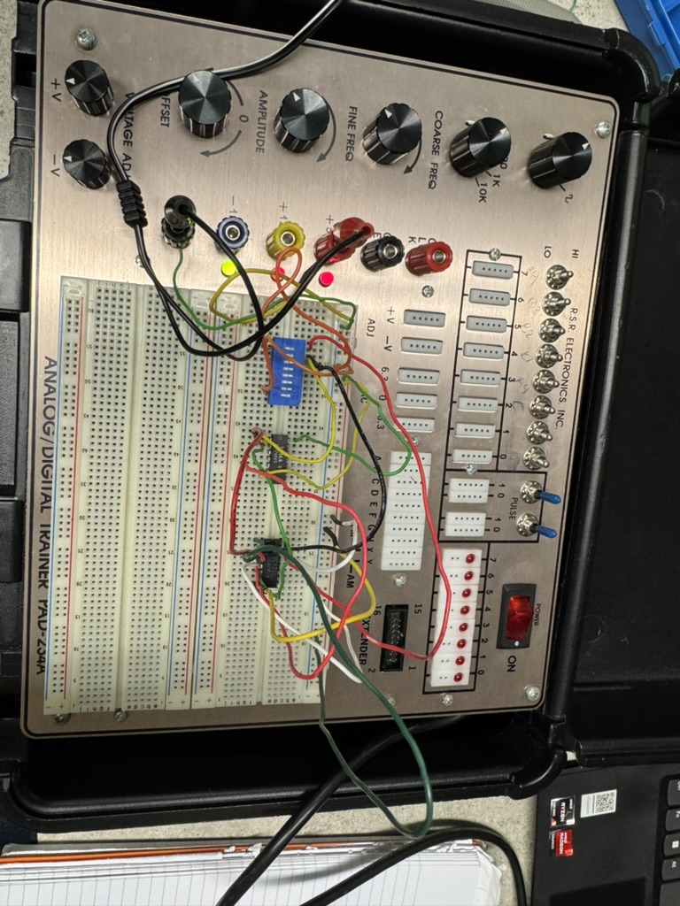
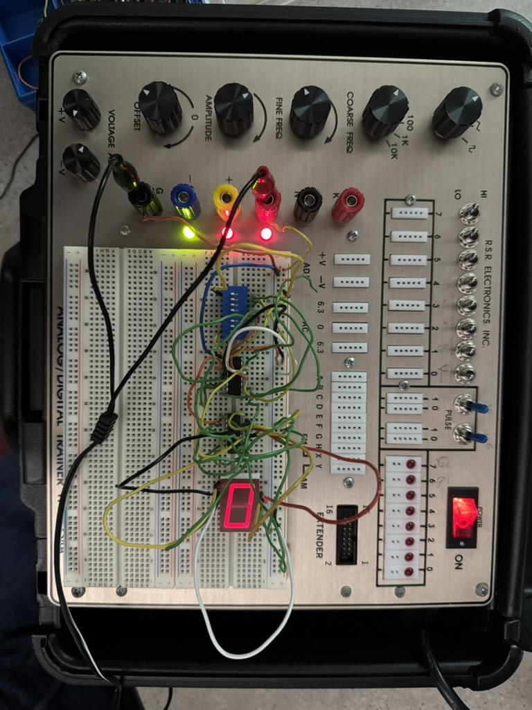

## How to View
Circuit photos are included for each lab. 
No code to run — these are hardware implementations.

# Digital Logic Labs — CSC 245
Combinational logic circuit implementations built and tested on the ETD108ET digital trainer board at Lyon College.

## Lab 5 — Boolean Functions Using Multiplexers

## Overview
Implemented two Boolean logic functions using multiplexers instead of traditional logic gates, demonstrating a more efficient approach to combinational circuit design.

## Components Used
- SN74153 — Dual 4-to-1 Multiplexer
- SN74151 — 8-to-1 Multiplexer
- ETD108ET Digital Trainer Board
- Logic Probe

## Functions Implemented

**Function 1** — Using SN74153 (4-to-1 MUX)
f(X, Y, Z) = XYZ + X'Z'
- Select lines connected to variables X and Y
- Data inputs set according to truth table
- Output verified with logic probe

**Function 2** — Using SN74151 (8-to-1 MUX)
f(W, X, Y, Z) = Σ(0, 1, 4, 7, 8, 12, 13, 15)
- W, X, Y connected to select lines
- D0 to D7 inputs set to match minterms
- Fourth variable Z handled through additional logic

## What I Learned
- How multiplexers can replace traditional logic gates for Boolean functions
- How to map a truth table directly to MUX select lines and data inputs
- Difference between 4-to-1 and 8-to-1 multiplexer implementations
- How to handle a fourth variable using additional logic on an 8-to-1 MUX

## Circuit Photo

## Lab 6 — 7-Segment Display Using Multiplexers

## Overview
Built a circuit to drive a 7-segment display using multiplexer logic on the ETD108ET digital trainer board. Wired and tested the display output using a logic probe.

### Components Used
- ETD108ET Digital Trainer Board
- 7-Segment Display
- Multiplexer ICs
- Logic Probe
- Wires

## Circuit Photo

---

## What I Learned
- How multiplexers simplify Boolean circuit design
- Converting truth tables into multiplexer-based implementations
- Hands-on experience building and testing combinational circuits
- Reading and verifying outputs with a logic probe

## Course
Digital Logic(CSC 245) — Lyon College
